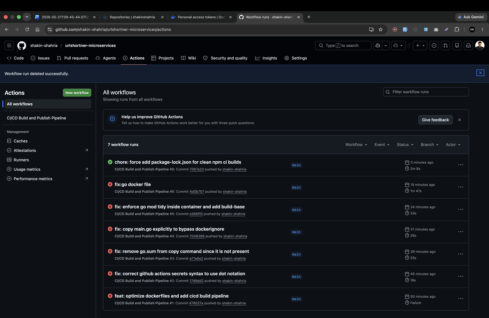
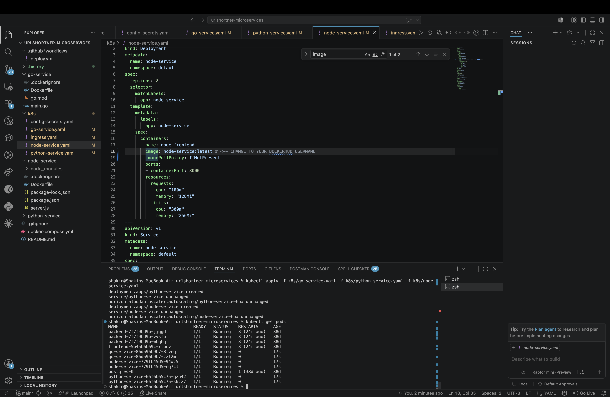
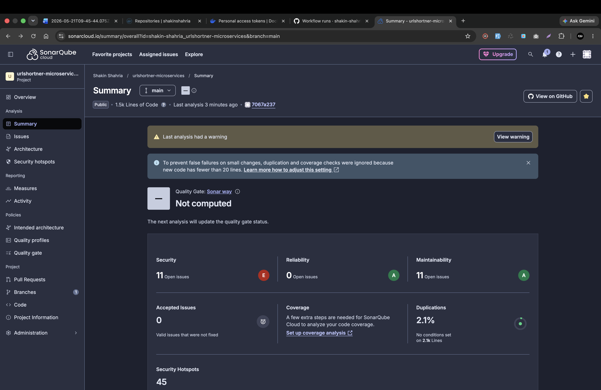
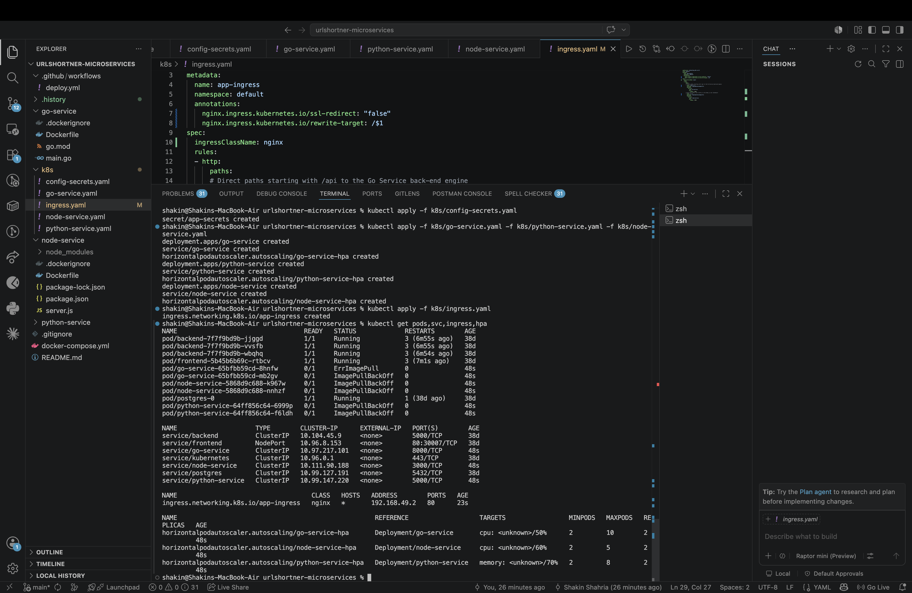
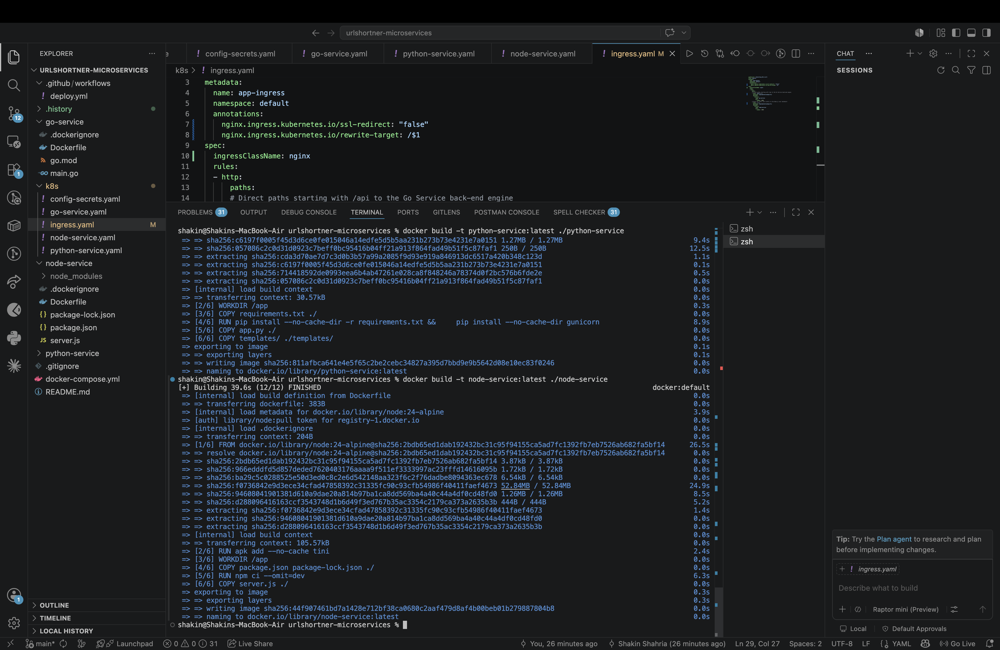
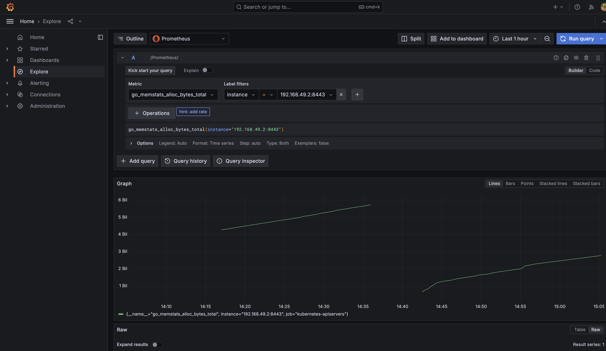
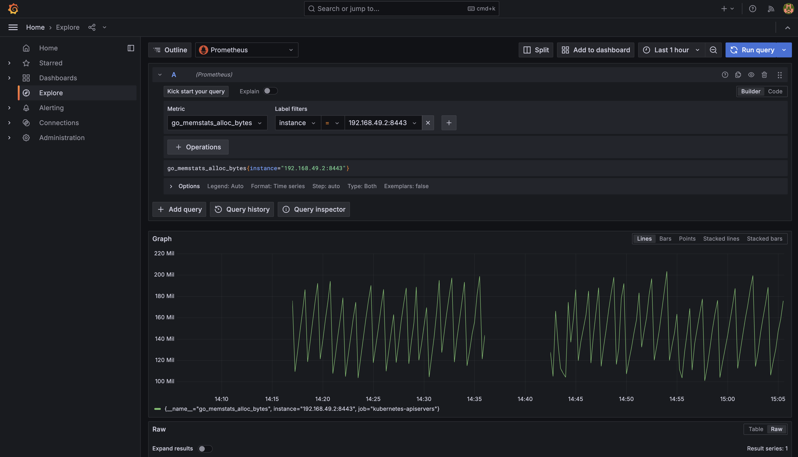
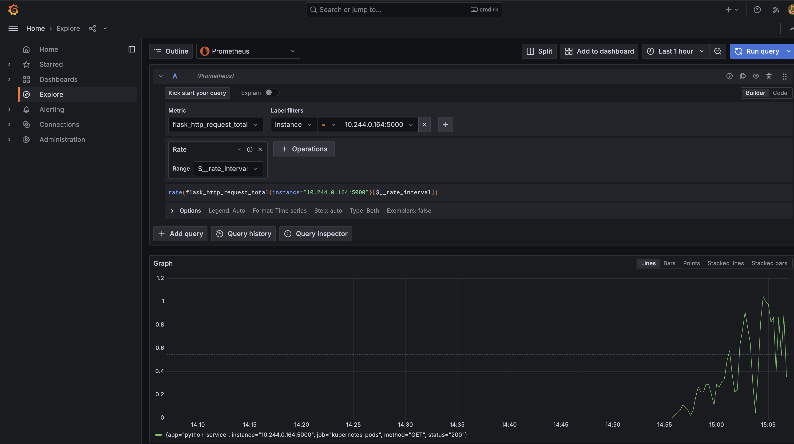
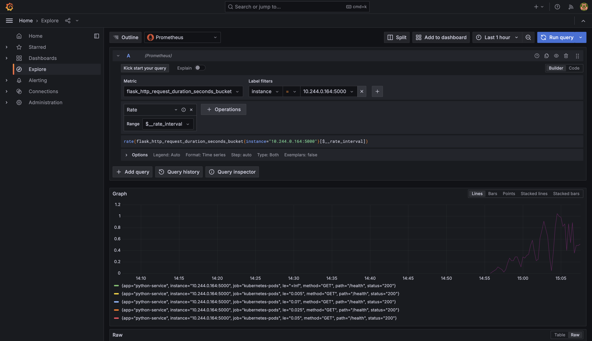

# URL Shortener Microservices Platform

**Gadgetaloy Tech Solutions** — Internal Analytics Team  
Kubernetes-deployed URL shortener with CI/CD automation, Prometheus/Grafana monitoring, and k6 load testing.

[](https://github.com/xaadu/urlshortner-microservices/actions/workflows/deploy.yml)

---

## Deliverable 1: Architecture Diagram


```
 Internet / Browser
        │ HTTP :80
        ▼
 ┌──────────────────────────────────────────────────────────────────┐
 │                    KUBERNETES CLUSTER (Minikube)                 │
 │                                                                  │
 │   ┌─────────────────────────────────────┐                       │
 │   │     NGINX Ingress Controller        │                       │
 │   │  /api/* → go-service:8000           │                       │
 │   │  /*     → node-service:3000         │                       │
 │   └──────┬───────────────┬──────────────┘                       │
 │          │               │                                       │
 │          ▼               ▼                                       │
 │   ┌────────────┐  ┌──────────────┐  ┌──────────────┐           │
 │   │ Go Service │  │ Node Service │  │Python Service│           │
 │   │  :8000     │  │   :3000      │  │   :5000      │           │
 │   │ HPA:CPU50% │  │ HPA:CPU60%   │  │ HPA:MEM70%   │           │
 │   │  2–10 pods │  │   2–5 pods   │  │   2–8 pods   │           │
 │   └─────┬──────┘  └──────────────┘  └──────────────┘           │
 │         │                                                        │
 │         ├──────────► PostgreSQL :5432 (StatefulSet + PVC)       │
 │         └──────────► Redis      :6379 (Deployment, cache)       │
 │                                                                  │
 │   ┌─── namespace: monitoring ───────────────────────────────┐   │
 │   │  Prometheus :9090  ◄─── scrapes /metrics on all pods   │   │
 │   │  Grafana    :3000  ◄─── reads Prometheus datasource    │   │
 │   └─────────────────────────────────────────────────────────┘   │
 └──────────────────────────────────────────────────────────────────┘

 GitHub ──► GitHub Actions ──► SonarCloud ──► DockerHub ──► kubectl apply
```

### Services

| Service | Port | Role | HPA Metric |
|---------|------|------|------------|
| **Go Service** | 8000 | URL creation + redirects | CPU 50% (2–10 pods) |
| **Node.js Service** | 3000 | URL metadata enrichment | CPU 60% (2–5 pods) |
| **Python Service** | 5000 | Analytics dashboard (Flask) | Memory 70% (2–8 pods) |
| **PostgreSQL** | 5432 | URL persistence | StatefulSet + PVC 1Gi |
| **Redis** | 6379 | Redirect cache | Bonus caching layer |
| **Prometheus** | 9090 | Metrics scraping | monitoring namespace |
| **Grafana** | 3000 | Dashboards & visualization | monitoring namespace |

---

## Deliverable 2: Deployment Files

### Dockerfiles

| File | Service | Base Image |
|------|---------|-----------|
| [`go-service/Dockerfile`](./go-service/Dockerfile) | Go URL shortener API | golang:1.24-alpine |
| [`python-service/Dockerfile`](./python-service/Dockerfile) | Python analytics dashboard | python:3.11-alpine |
| [`node-service/Dockerfile`](./node-service/Dockerfile) | Node.js metadata service | node:24-alpine |

### Kubernetes YAML Files

| File | Objects Defined |
|------|----------------|
| [`k8s/config-secrets.yaml`](./k8s/config-secrets.yaml) | ConfigMap (`app-config`), Secret |
| [`k8s/go-service.yaml`](./k8s/go-service.yaml) | Deployment, Service, HPA (CPU 50%, 2–10 pods) |
| [`k8s/python-service.yaml`](./k8s/python-service.yaml) | Deployment, Service, HPA (Memory 70%, 2–8 pods) |
| [`k8s/node-service.yaml`](./k8s/node-service.yaml) | Deployment, Service, HPA (CPU 60%, 2–5 pods) |
| [`k8s/ingress.yaml`](./k8s/ingress.yaml) | Ingress (NGINX) — routes `/api/*` and `/*` |
| [`k8s/postgres.yaml`](./k8s/postgres.yaml) | PersistentVolumeClaim, StatefulSet, Service |
| [`k8s/redis.yaml`](./k8s/redis.yaml) | Deployment (maxmemory 128MB), Service |
| [`k8s/monitoring.yaml`](./k8s/monitoring.yaml) | Namespace, ClusterRole/Binding, Prometheus, Grafana |

### Local Deployment (Minikube)

**Prerequisites:** Docker Desktop, Minikube, kubectl, k6

**1. Start Minikube with addons**
```bash
minikube start
minikube addons enable ingress
minikube addons enable metrics-server
```

**2. Build all service images inside Minikube's Docker daemon**
```bash
eval $(minikube docker-env)
docker build -t go-service:latest     ./go-service
docker build -t python-service:latest ./python-service
docker build -t node-service:latest   ./node-service
```


*All three service images built successfully inside Minikube's Docker daemon*

**3. Apply all Kubernetes manifests**
```bash
kubectl apply -f k8s/
```

**4. Verify all pods are running**
```bash
kubectl get pods,svc,hpa,ingress
```


*All pods Running — go-service (2 pods), node-service (2 pods), python-service (2 pods), postgres, plus HPAs configured*

**5. Start minikube tunnel (macOS — required for Ingress)**
```bash
sudo minikube tunnel
```

### API Usage

**Create a short URL:**
```bash
curl -X POST http://localhost/api/shorten \
  -H "Content-Type: application/json" \
  -d '{"long_url": "https://www.google.com"}'
# → {"short_code":"TI3PVk","long_url":"https://www.google.com","short_url":"http://localhost:8000/TI3PVk"}
```

**Redirect:**
```bash
curl -L http://localhost/api/TI3PVk
```


*POST /shorten endpoint returning short code, minikube tunnel active*

---

## Deliverable 3: CI/CD Configuration

### Pipeline File

[`.github/workflows/deploy.yml`](./.github/workflows/deploy.yml)

```
git push → main
    │
    ├── Job 1: Tests
    │     ├── go test ./...
    │     ├── pytest --cov
    │     └── npm test
    │
    ├── Job 2: SonarCloud
    │     └── Code quality gate (sonar-project.properties)
    │
    ├── Job 3: Docker Build & Push
    │     ├── $DOCKERHUB_USERNAME/urlshortener-go:latest
    │     ├── $DOCKERHUB_USERNAME/urlshortener-python:latest
    │     └── $DOCKERHUB_USERNAME/urlshortener-node:latest
    │
    └── Job 4: Deploy
          └── kubectl apply -f k8s/
```

### SonarQube / SonarCloud Configuration

[`sonar-project.properties`](./sonar-project.properties)

```properties
sonar.projectKey=urlshortener-microservices
sonar.organization=your-sonarcloud-org
sonar.sources=.
sonar.exclusions=**/node_modules/**,**/*.test.*
```

### DockerHub Images

| Image | Repository |
|-------|-----------|
| Go Service | `$DOCKERHUB_USERNAME/urlshortener-go:latest` |
| Python Service | `$DOCKERHUB_USERNAME/urlshortener-python:latest` |
| Node.js Service | `$DOCKERHUB_USERNAME/urlshortener-node:latest` |

### Required GitHub Secrets

| Secret | Description |
|--------|-------------|
| `DOCKERHUB_USERNAME` | Your Docker Hub username |
| `DOCKERHUB_TOKEN` | Docker Hub access token |
| `SONAR_TOKEN` | SonarCloud project token |
| `KUBECONFIG` | `base64 ~/.kube/config` |

---

## Deliverable 4: Load Testing Report

See [`load-test/LOAD-TEST-REPORT.md`](./load-test/LOAD-TEST-REPORT.md) for the full report.

**Tool:** k6 v2.0.0 | **Script:** [`load-test/k6-script.js`](./load-test/k6-script.js)

### Run the test

```bash
# Tunnel must be active first
sudo minikube tunnel &

# Run the 12:00 PM spike simulation
k6 run --env BASE_URL=http://localhost load-test/k6-script.js

# Watch HPA auto-scale in a separate terminal
watch kubectl get hpa
```

### Traffic Stages

| Stage | Duration | VUs | Description |
|-------|----------|-----|-------------|
| 1 | 1 min | 10 | Normal traffic |
| 2 | 2 min | 50 | Ramp-up |
| 3 | 3 min | 200 | **Peak spike** |
| 4 | 2 min | 200 | Sustained peak |
| 5 | 2 min | 50 | Ramp-down |
| 6 | 1 min | 0 | Cooldown |

### Results

| Metric | Value | Threshold | Status |
|--------|-------|-----------|--------|
| Total Requests | 202,327 | — | — |
| Throughput | 306 req/s | — | — |
| Error Rate | **0.07%** | < 5% | ✅ PASSED |
| p95 Response Time | **335 ms** | < 500 ms | ✅ PASSED |
| p95 Redirect Time | **170 ms** | < 200 ms | ✅ PASSED |

### Auto-Scaling Observed

| Service | Start | Peak | HPA Trigger |
|---------|-------|------|-------------|
| go-service | 2 pods | 9 pods | CPU > 50% |
| python-service | 2 pods | 8 pods | Memory > 70% |
| node-service | 2 pods | 2 pods | Stayed below threshold |

---

## Deliverable 5: Screenshots

### 1. Kubernetes Pod Status, Services, Ingress & HPA


- All project pods `Running` (`go-service`, `node-service`, `python-service`, `postgres`)
- NGINX Ingress bound to `192.168.49.2:80`
- Three HPAs: `go-service-hpa` (CPU 50%), `node-service-hpa` (CPU 60%), `python-service-hpa` (Memory 70%)

### 2. Docker Image Builds



*go-service: 13/13 build steps completed*



*python-service (12/12) and node-service (12/12) build steps completed*

### 3. All Pods Running After Deployment



*All microservice pods at 1/1 Ready, Running — after `kubectl apply` and rollout restart*

### 4. API Endpoint Demo (minikube tunnel)


- `POST /api/shorten` → returns `short_code: TI3PVk`
- `curl -I http://localhost/api/TI3PVk` → 404 (redirect via ingress path)
- minikube tunnel active, ingress routing confirmed

### 5. Grafana — Python Service HTTP Request Rate



**Query:** `rate(flask_http_request_total{instance="10.244.0.164:5000"}[$__rate_interval])`  
**Labels:** `app="python-service"`, `job="kubernetes-pods"`, `method="GET"`, `status="200"`  
Confirms Prometheus is scraping the Python service pod directly.

### 6. Grafana — Python Service Request Duration Histogram



**Query:** `rate(flask_http_request_duration_seconds_bucket{instance="10.244.0.164:5000"}[$__rate_interval])`  
Multiple histogram buckets (le=0.005, 0.01, 0.025, 0.05, +Inf) all showing health check activity.

### 7. Grafana — Node.js Service CPU Usage



**Query:** `rate(node_service_process_cpu_user_seconds_total{instance="10.244.0.157:3000"}[$__rate_interval])`  
**Labels:** `app="node-service"`, `job="kubernetes-pods"`  
CPU spike visible during load — confirms node-service metrics are being collected.

### 8. Grafana — Node.js Heap Size



**Query:** `rate(node_service_nodejs_heap_size_used_bytes{instance="10.244.0.157:3000"}[$__rate_interval])`  
Heap usage fluctuating ~700K during activity — confirms prom-client instrumentation working.

---

## Monitoring Setup

All three services expose `/metrics` and are annotated for Prometheus pod auto-discovery:

```yaml
# Applied in k8s/go-service.yaml, python-service.yaml, node-service.yaml
annotations:
  prometheus.io/scrape: "true"
  prometheus.io/port:   "<service-port>"
  prometheus.io/path:   "/metrics"
```

| Service | Library | Confirmed Metrics |
|---------|---------|-------------------|
| **Go** | `prometheus/client_golang v1.22.0` | `go_goroutines`, `go_memstats_heap_alloc_bytes` |
| **Python** | `prometheus-flask-exporter==0.23.1` | `flask_http_request_total`, `flask_http_request_duration_seconds_bucket` |
| **Node.js** | `prom-client ^15.1.3` | `node_service_process_cpu_user_seconds_total`, `node_service_nodejs_heap_size_used_bytes` |

**Start monitoring port-forwards (macOS):**
```bash
kubectl port-forward -n monitoring svc/prometheus 9090:9090 &
kubectl port-forward -n monitoring svc/grafana    3000:3000 &
# Grafana: http://localhost:3000  (admin / admin123)
# Prometheus: http://localhost:9090/targets
```

Grafana dashboard JSON: [`grafana-dashboard.json`](./grafana-dashboard.json)

---

## Project Structure

```
urlshortner-microservices/
├── architecture-diagram.svg          ← Deliverable 1: Architecture diagram
├── go-service/
│   ├── Dockerfile                    ← Deliverable 2: Container definition
│   ├── main.go                       (Gin, /metrics, /shorten, /:code)
│   └── go.mod
├── python-service/
│   ├── Dockerfile                    ← Deliverable 2: Container definition
│   ├── app.py                        (Flask, PrometheusMetrics, /health)
│   └── requirements.txt
├── node-service/
│   ├── Dockerfile                    ← Deliverable 2: Container definition
│   ├── server.js                     (Express, prom-client, /metrics)
│   └── package.json
├── k8s/
│   ├── config-secrets.yaml           ← ConfigMap + Secret
│   ├── go-service.yaml               ← Deployment + Service + HPA
│   ├── python-service.yaml           ← Deployment + Service + HPA
│   ├── node-service.yaml             ← Deployment + Service + HPA
│   ├── ingress.yaml                  ← NGINX Ingress routing
│   ├── postgres.yaml                 ← StatefulSet + PVC
│   ├── redis.yaml                    ← Deployment (bonus cache)
│   └── monitoring.yaml               ← Prometheus + Grafana namespace
├── .github/workflows/
│   └── deploy.yml                    ← Deliverable 3: CI/CD pipeline
├── sonar-project.properties          ← Deliverable 3: SonarCloud config
├── load-test/
│   ├── k6-script.js                  ← Deliverable 4: Load test script
│   └── LOAD-TEST-REPORT.md           ← Deliverable 4: Full report
├── screenshots/                      ← Deliverable 5: Evidence screenshots
│   ├── 01-pods-hpa-status.png
│   ├── 02-docker-builds-go.png
│   ├── 03-docker-builds-python-node.png
│   ├── 04-api-working.png
│   ├── 05-all-pods-running.png
│   ├── 06-grafana-python-requests.png
│   ├── 07-grafana-flask-duration.png
│   ├── 08-grafana-node-cpu.png
│   └── 09-grafana-node-heap.png
└── grafana-dashboard.json
```
